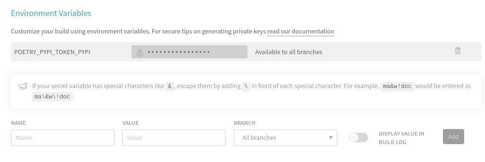

# Rapid python package setup with modern venv, dependencies, testing, docs, and CI

[](https://img.shields.io/travis/com/iancleary/pypackage)
[](https://github.com/iancleary/pypackage/graphs/contributors)

## The Basic Idea

This is a template module collecting many utilities I have liked from other projects, to serve as a personal reference.

- [https://github.com/tiangolo/fastapi/](https://github.com/tiangolo/fastapi/)
- [https://github.com/tiangolo/full-stack-fastapi-postgresql](https://github.com/tiangolo/full-stack-fastapi-postgresql)
- [https://github.com/cookiecutter/cookiecutter](https://github.com/cookiecutter/cookiecutter)

## Getting started with this template

```bash
pip install --user cookiecutter

$ cookiecutter https://github.com/iancleary/pypackage
# For the sake of brevity, repos on GitHub can just use the 'gh' prefix
$ cookiecutter gh:iancleary/pypackage
```

## Features

- Poetry (virtual environment and publish, all with one tool)
- black (linting/formatter)
- autoflake (removing unused packages)
- isort (dependency organization)
- mypy (static type checking)
- pytest (including test coverage)
- travis-ci for CI/CD
- mkdocs for documentation (with material theme)

Only **Python 3.6+** is supported as required by the black, pydantic packages

----------

## Publishing to Pypi

Login to pypi and create a token.

<https://python-poetry.org/docs/repositories/#configuring-credentials>

```bash
POETRY_PYPI_TOKEN_PYPI=my-token
```

Login to travis-ci.com to add an environment variable:



## Contributing Guide

See the [Contributing Guide](CONTRIBUTING.md) and welcome!
