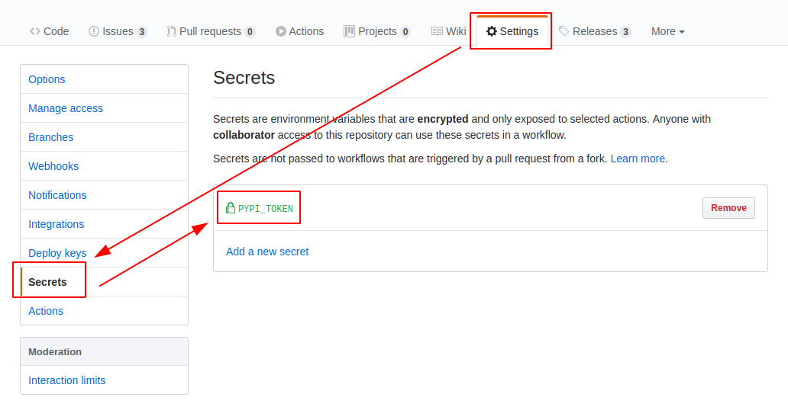

# pypackage

<p align="center">
    <em>Rapid python package setup with modern venv, dependencies, testing, docs, and CI</em>
</p>

<p align="center">
<a href="https://github.com/iancleary/pypackage/actions?query=workflow%3ATest" target="_blank">
    
</a>
<a href="https://github.com/iancleary/pypackage/actions?query=workflow%3APublish" target="_blank">
    
</a>
</p>

## The Basic Idea

This is a template module collecting many utilities I have liked from other projects, to serve as a personal reference.

- [https://github.com/tiangolo/pydantic-sqlalchemy/](https://github.com/tiangolo/pydantic-sqlalchemy/)
- [https://github.com/cookiecutter/cookiecutter](https://github.com/cookiecutter/cookiecutter)

## Getting started with this template

```bash
pip install --user cookiecutter

$ cookiecutter https://github.com/iancleary/pypackage
# For the sake of brevity, repos on GitHub can just use the 'gh' prefix
$ cookiecutter gh:iancleary/pypackage
```

## Features

- Poetry (virtual environment and publish to PyPi, all with one tool)
- black (linting/formatter)
- autoflake (removing unused packages)
- isort (dependency organization)
- mypy (static type checking)
- pytest (including test coverage)
- GitHub Actions for CI/CD
- mkdocs for documentation (with material theme)

Only **Python 3.6+** is supported as required by the black, pydantic packages

----------

## Publishing to Pypi

### Poetry's documentation

Note that it is recommended to use [API tokens](https://pypi.org/help/#apitoken) when uploading packages to PyPI.

>Once you have created a new token, you can tell Poetry to use it:

<https://python-poetry.org/docs/repositories/#configuring-credentials>

We do this using GitHub Actions' Workflows and Repository Secrets!

### Repo Secrets

Go to your repo settings and add a `PYPI_TOKEN` environment variable:



### Inspect the GitHub Actions Publish Workflows

> Within the cookiecutter project!

```yml
name: Publish

on:
  release:
    types:
      - created

jobs:
  publish:
    runs-on: ubuntu-latest
    steps:
      - uses: actions/checkout@v2
      ...
      ...
      ...
      - name: Publish
        env:
          PYPI_TOKEN: ${{ secrets.PYPI_TOKEN }}
        run: |
          poetry config pypi-token.pypi $PYPI_TOKEN
          bash scripts/publish.sh
```

> That's it!

When you make a release on GitHub, the publish workflow will run and deploy to PyPi! 🚀🎉😎

> The GitHub Actions for the top level intentionally on build, which demonstrates the publish workflow.

## Contributing Guide

Welcome! 😊👋

> Please see the [Contributing Guide](CONTRIBUTING.md).
